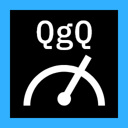
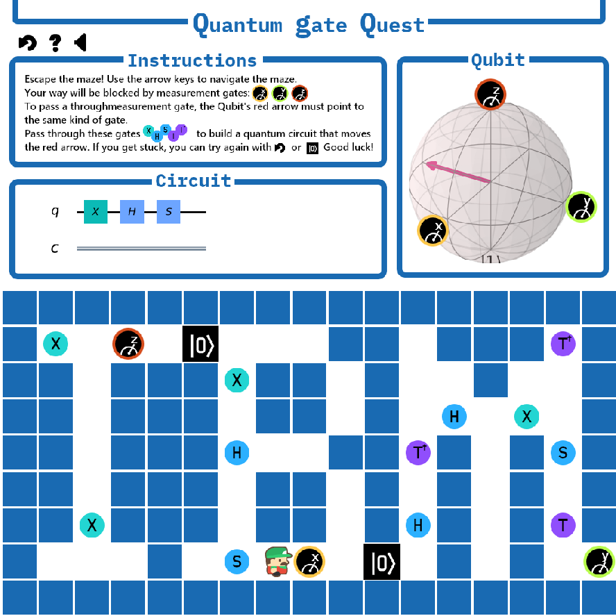

# Quantum Gate Quest

Quantum Gate Quest is a classic 2D dungeon crawler whose puzzles are powered by IBM's quantum technology!

Author: Nick Bartzokas

In Quantum Gate Quest, you find yourself trapped in a maze. In order to escape, you need to solve quantum gate puzzles, walk across quantum gates, and manipulate a qubit to unlock blocked passageways. Learn the effects of each kind of gate in order to win. Good luck with your Quantum Gate Quest!

Project stack: python + Qiskit, javascript + PhaserJS

## Install and Run

* Install Python 3.7.5 and pip 19.3.1
* Run `pip install -r requirements.txt` to install all python requirements
* Run `npm install` to install all npm requirements
* Run `npm start` to webpack the project and run the python server
* Open `http://127.0.0.1:5000/` to play the game

## Code

The project's back-end is written in Python using IBM's [Qiskit](https://qiskit.org/). All backend code is in `server.py`. The front-end is written with the Javascript library [Phaser](http://phaser.io/).

## Credits

Project authored by Nick Bartzokas. Thanks to CC0/public domain contributors [Juhani Junkala](https://juhanijunkala.com/) for music and [Kenney](https://kenney.nl/) for graphics.
